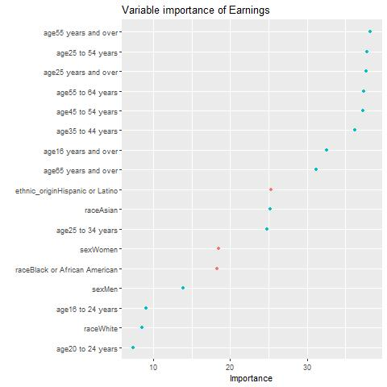

# Earnings-and-Employment

This is a report for Big Data (C7084), demonstrating the use of Spark to manage big datasets.

The GitHub Repository containing all data and code for the report can be found here: (https://github.com/OttilieM/Earnings-annd-Employment)

Contents:

[1. The Problem](#1-the-problem)

[2. Objectives](#2-objectives)

[3. Data](#3-data)
  - [3.1 Data Descriptions](#31-data-descriptions)
  - [3.2 Data Preparation](#32-data-preparation)
  - [3.3 Sparklyr](#33-sparklyr)
  
[4. Methods](#4-methods)

[5. Results](#5-results)

[6. Discussion](#6-discussion)

[7. References](#7-references)

## 1. The Problem
Income inequality is defined as a measure of the variation of earnings between different individuals, gender, ethnicity and age.  Levels of poverty indicate a sectors inability to access goods and services that most people consider necessary for an acceptable standard of living. Inequality refers to the difference in living standards and income across the whole economic divide and can be found in a society without high levels of poverty, due to a large difference between the top and the middle of the income spectrum.

In the US, equal opportunities improved in the 20th century through education, with genders and ethnic groups benefitting from the same educational opportunities and it is now more accepted that there is an equal division of housework and childcare.  

The US has undergone several periods of depression over the last century, including the 2008-2010 financial crisis when approximately 8.7 million jobs were lost, with real GDP contracting by 4.2%.  Unemployment rates did not recover to their previous rate until May 2014. The most recent depression is on-going, with a record low of 20.5m abrupt job losses being recorded in April 2020 due to the Covid-19 pandemic.  

## 2. Objectives
•	Which factors have the most impact on earnings?

•	How have earnings between men and women changed over time?

•	Which factors influenced job losses during the Covid-19 pandemic?

## 3. Data

### 3.1 Data Descriptions
Data was sourced from a TidyTueday on Github. The data was originally collected from the US Bureau of Labor Statistics 2010-2020 with additional data added to increase the time span to 1995-2020. Data can be found on my GitHub page: (https://github.com/OttilieM/Earnings-annd-Employment) 

The data was pulled from 2 datasets, representing earnings and employment in the US.

The Employment dataset is made up of 8184 rows and 7 variables. 

|variable         |class     |description |
|:----------------|:---------|:-----------|
|industry         |character | Industry group |
|major_occupation |character | Major Occupation category |
|minor_occupation |character | Minor Occupation Categoru |
|race_gender      |character | Race or gender group (total, men/women, race) |
|industry_total   |double    | Industry total |
|employ_n         |double    | Employed number |
|year             |integer   | Year |

The Earnings dataset is made up of 4341 rows and 8 variables.

|variable           |class     |description |
|:------------------|:---------|:-----------|
|sex                |character | Gender |
|race               |character | Racial group |
|ethnic_origin      |character | Ethnic origin (hispanic or non-hispanic) |
|age                |character | Age group |
|year               |integer   | Year  |
|quarter            |integer   | Quarter |
|n_persons          |double    | Number of persons employed by group|
|median_weekly_earn |integer   | Median weekly earning in current dollars|

### 3.2 Data Preparation
Spark was used to demonstrate how data can be stored remotely, however, due to storage issues, datasets had to be significantly reduced before loading them into Spark. 

Both datasets were downloaded, cleaned by removing missing data and data wrangling was undertaken. 

A number of inputs were removed from the industry column in the employment data, as these were not relevant. The size of the data frame was reduced further by removing the columns for major and minor occupation, removing rows in race_gender equal to “TOTAL” and filtered by year to only include 2019 and 2020 data. This reduced the employed dataset to 2090 observations and 5 variables.

A new dataset named “covid” was created by adding a new variable to show the difference in number employed from 2019 to 2020 in each of the industries. This dataset was made up of 19 observations and 4 variables.

Secondly, the earn dataset was used to create a new data frame named “gender”. This filtered the earn dataset to only include men and women, quarter 1, all ages over 16, all races and all origins. This dataset was made up of 52 observations and 8 variables.

This gender dataset was then used to create a new dataset showing the difference in earnings between men and women over a period of twenty five years. This included 26 observations and 16 variables.

Once reduced dataset were prepared, a Spark connection was initiated and datasets were loaded into Spark.

## 4. Methods
The cleaned earnings dataset underwent some preliminary analysis to determine how many variables should be looked at to determine median weekly earnings, using the regsubset() function, concluding that all variables were significant.

The dataset was split randomly into a train and test set using an 80/20 split. Several linear regression models were tested to determine the best model, concluding that the best model included all variables. This model was then tested to the unseen test data, giving a 90.03% accuracy. Using this same model, a variable importance plot was created to visually display important social factors effecting median weekly earnings.

Linear regression was also used to model the significance of sex on median weekly earnings, showing that men had a positive impact, whilst being female had a negative impact. Data visualisations were used to show how men’s and women’s earnings differ, and how they have changed over time.

Data visualisations were used to display the number employed in each industry, together with the number of job losses that occurred from 2019 to  2020, over the Covid-19 pandemic.

Finally, principal component analysis was used to demonstrate the variables which impacted these job losses and in which industries.

## 5. Results

The 3 factors highlighted in red in the graph above, show that being Hispanic, Latino, female or Black African American, had a negative impact on median weekly earnings. The analysis shows that age is the most significant factor determining wage, with those aged 55 years shown to have the highest earnings.  Age is a key variable effecting earnings as this tends to represent experience and the build-up of skills over time.

Although sex is not deemed a significant factor in determining median wage, it is important to point out that women have a higher negative impact on earnings, whilst men have a lower positive impact. Similarly, Black or African American has a higher negative impact on earnings, whilst White has a smaller positive impact. Gender-based pay discrimination has been illegal since 1963, however, it is still a widespread practice. 

It is important to note than many of these factors can be directly and indirectly influenced by discrimination based on gender, race or ethnicity, for example, societal and structural sexism often influences the jobs that women work in, taking on the majority of care giving, house-work and other unpaid responsibilities that men do not. Experts have attributed the estimated 38% of the wage gap that is not explained by traditional, measurable factors, such as hours worked and years of experience, to the effects of discrimination. This discrimination most likely affects far more than the reported 38% of the wage gap.

There is a significant difference in weekly median earnings by gender. This could be explained in part by women choosing to work part-time and experiencing more career interruptions than men, due to accommodating care giving and unpaid obligations, with lower hourly wages and fewer hourly benefits compared to full time workers. Despite this, women with the highest earnings are still recording significantly lower earnings than those of men.

The median weekly earnings of men have consistently been higher than women from 1995 to 2020, with women’s earnings being 26% lower than men in 1995 and 19% lower in 2020. These findings are surprising, despite the gender equality in educational opportunities and within society. 

The impact of the financial crisis in 2010, affected men’s earnings disproportionately to women’s, who proved to be more resilient in maintaining employment. 

The graph above shows that the gender pay gap has widened over the years.

The US economy relies on a variety of industries to remain competitive in the global markets. Their largest employment industry is within education and health services which employ over 1.5 million. The Covid -19 outbreak started in March 2019, significantly impacting employment as some industries had to close completely. Leisure and hospitality were hardest hit, with the loss of over 1.2 million jobs. The only sector to benefit for the pandemic was Public Administration, which employed nearly 100,000. Similarly, agriculture and related industries, mining, quarrying, oil and gas extraction have not been significantly impacted, losing just 32,000 and 25,400 respectively. 

Black and Asian factors influenced job losses and are strongly correlated with each other, those who were less likely to lose their jobs over Covid-19 are those who are white and men. According to PC1, women were less likely to lose their jobs, however PC2, which makes up 28.4% of the variance, indicated that women made up a significant number of job losses.

The factors which negatively influenced these job losses were Black and Asian, with those less likely to lose jobs being those who are white or men.

