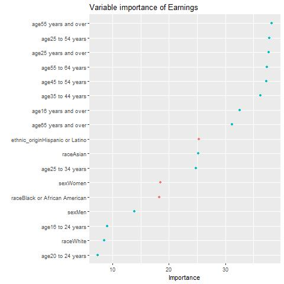
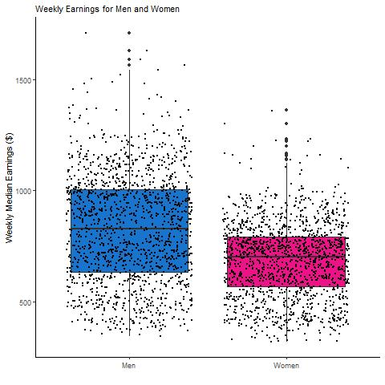
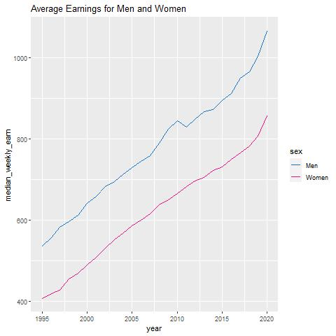
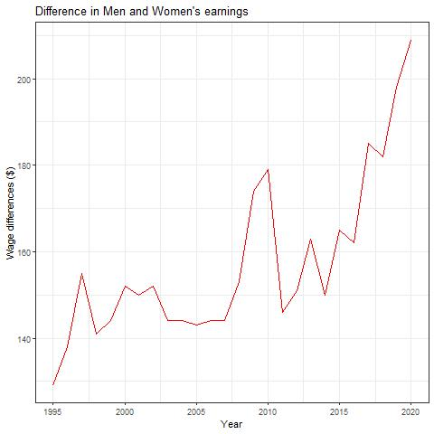
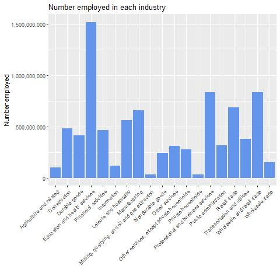
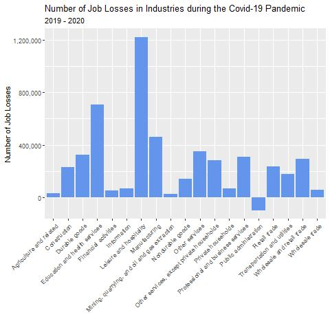

# Earnings-and-Employment

This is a report for Big Data (C7084), demonstrating the use of Spark to manage big datasets.

The GitHub Repository containing all data and code for the report can be found here: (https://github.com/OttilieM/Earnings-annd-Employment)

Contents:

[1. Background](#1-background)

[2. Objectives](#2-objectives)

[3. Data](#3-data)
  - [3.1 Data Descriptions](#31-data-descriptions)
  - [3.2 Data Preparation](#32-data-preparation)
  
[4. Methods](#4-methods)
  - [4.1 EDA](#41-EDA)
  - [4.2 Analysis](#42-analysis)

[5. Results](#5-results)

[6. Discussion](#6-discussion)

[7. References](#7-references)

## 1. Background
Income inequality is defined as a measure of the variation of earnings between different individual’s gender, ethnicity, race and age (OECD, 2020).  Levels of poverty indicate a sectors inability to access goods and services that most people consider necessary for an acceptable standard of living. Inequality refers to the difference in living standards and income across the whole economic divide and can be found in a society without high levels of poverty, such as the United State (US), due to a large difference between the top and the middle of the income spectrum (Dabla-Norris, *et al*., 2015).

In the US, gender-based pay discrimination has been illegal since 1963, however, it is still a widespread practice. Equal opportunities improved in the 20th century through education (Baker, 2016), with genders and ethnic groups benefiting from the same educational opportunities and it is now more accepted that there is an equal division of housework and childcare.  Despite these dramatic changes, large gaps remain within educational attainment in minority African-American and Hispanic-Latino groups, who are often segregated by ethnicity and race and are more likely to attend high-poverty schools than Asian-Americans and Caucasians  (National Center for Education Statistics, 2015). This sector often experiences not only low levels of educational attainment, but low economic development and poor health.

The US has undergone several periods of depression over the last century, including the 2008-2010 financial crisis when approximately 8.7 million jobs were lost, with real GDP contracting by 4.2% (Long and Van Dam, 2020).  Unemployment rates did not recover to their previous rate until May 2014. The most recent depression is on-going, with a record low of 20.5m abrupt job losses being recorded in April 2020 due to the Covid-19 pandemic (Fowers, 2020).  

This report provides an analysis of a range of factors affecting earnings such as age, gender, ethnicity and racial group, details on how the gender pay gap has changed over time, and how the Covid-19 pandemic influenced job losses.
 

## 2. Objectives
•	Which factors have the most impact on earnings?

•	How have earnings between men and women changed over time?

•	Which factors influenced job losses during the Covid-19 pandemic?

## 3. Data

### 3.1 Data Descriptions
Data was sourced from a TidyTueday on Github. The data was originally collected from the US Bureau of Labor Statistics (2021) 2010-2020 with additional data added to increase the time span to 1995-2020. Data can be found on my GitHub page: (https://github.com/OttilieM/Earnings-annd-Employment) 

The data was pulled from 2 datasets, representing employment and earnings in the US.

The employment data set is made up of 8184 rows and 7 variables. 

|variable         |class     |description |
|:----------------|:---------|:-----------|
|industry         |character | Industry group |
|major_occupation |character | Major Occupation category |
|minor_occupation |character | Minor Occupation Categoru |
|race_gender      |character | Race or gender group (total, men/women, race) |
|industry_total   |double    | Industry total |
|employ_n         |double    | Employed number |
|year             |integer   | Year |

The Earnings dataset is made up of 4341 rows and 8 variables.

|variable           |class     |description |
|:------------------|:---------|:-----------|
|sex                |character | Gender |
|race               |character | Racial group |
|ethnic_origin      |character | Ethnic origin (hispanic or non-hispanic) |
|age                |character | Age group |
|year               |integer   | Year  |
|quarter            |integer   | Quarter |
|n_persons          |double    | Number of persons employed by group|
|median_weekly_earn |integer   | Median weekly earning in current dollars|

### 3.2 Data Preparation
Spark was used to demonstrate how data can be stored remotely, however, due to storage issues, datasets had to be significantly reduced before loading them into Spark. 

Both datasets were downloaded, cleaned by removing missing data and data wrangling was undertaken.

Using the dplyr package, a number of inputs were removed from the industry column in the employment data, as these were not relevant using the filter() function. The size of the data frame was reduced further by removing the columns for major and minor occupation, removing rows in race_gender equal to “TOTAL” and filtered by year to only include 2019 and 2020 data. This reduced the employed dataset to 2090 observations and 5 variables.

A new dataset named “covid” was created by adding a new variable to show the difference in number employed from 2019 to 2020 in each of the industries. The group_by() and summarise() functions were used together to create an average for the number employed in each industry in 2019 and 2020. The 2019 and 2020 datasets were merged by industry, and a new column created using the mutate() function to show the difference in employment over the covid period. This dataset was made up of 19 observations and 4 variables.

The earn dataset was used to create a new data frame named “gender”. This filtered the earn dataset to only include men and women, quarter 1, all ages over 16, all races and all origins. This dataset was made up of 52 observations and 8 variables.

The gender dataset was then used to create a new dataset showing the difference in earnings between men and women over a period of twenty-five years. Two subsets for men and women were created, renaming the median_weekly_earn column to differentiate between men and women’s earnings. The separate datasets were then merged by years, and the difference in earnings was calculated using the mutate() function. This included 26 observations and 16 variables.

Once reduced dataset were prepared, the Sparklyr library was loaded and a Spark connection was initiated. Spark allows data to be stored remotely from your local device. All the datasets were loaded into Spark using the copy_to() function, which is part of the dplyr library.

## 4. Methods

### 4.1 EDA
The cleaned earnings dataset underwent some preliminary analysis to determine how many variables should be looked at to determine median weekly earnings, using the regsubset() function, concluding that all variables were significant.

### 4.2 Analysis
The dataset was split randomly into a train and test set using an 80/20 split. Several linear regression models were tested to determine the best model, using the ml_linear_regression() function, part of the sparklyr package, concluding that the best model included all variables. This model was then tested to the unseen test data using the ml_evaluate() function, giving R2 = 0.9003, higher than the models using the training data. 

The model was adapted, to only include social factors (age, gender, ethnic origin and race), to create a variable importance plot to visually display important social factors effecting median weekly earnings. Forward stepwise selection was used as variables are not correlated with each other, so only those factors which are important are considered.

Linear regression was also used to model the significance of sex on median weekly earnings, showing that men had a positive impact, whilst being female had a negative impact. Data visualisations were used to show how men’s and women’s earnings differ, and how they have changed over time.

Data visualisations were used to display the number employed in each industry, together with the number of job losses that occurred from 2019 to  2020, over the Covid-19 pandemic.

Finally, principal component analysis was used to demonstrate the variables which impacted these job losses and in which industries.

## 5. Results

The three factors highlighted in red in the graph above, show that being Hispanic, Latino, female or Black African American, had a negative impact on median weekly earnings. The analysis shows that age is the most significant factor determining wage, with those aged 55 years shown to have the highest earnings.  Age is a key variable effecting earnings as this tends to represent experience and the build-up of skills over time.

Although sex is not deemed a significant factor in determining median wage, it is important to point out that women have a higher negative impact on earnings, whilst men have a lower positive impact. Similarly, Black or African American have a higher negative impact on earnings, whilst White has a smaller positive impact.

There is a significant difference in weekly median earnings by gender. This could be explained in part by women choosing to work part-time and experiencing more career interruptions than men, due to accommodating care giving and unpaid obligations, with lower hourly wages and fewer hourly benefits compared to full time workers. Despite this, women with the highest earnings are still recording significantly lower earnings than those of men.

The median weekly earnings of men have consistently been higher than women from 1995 to 2020, with women’s earnings being 26% lower than men in 1995 and 19% lower in 2020. These findings are surprising, despite the gender equality in educational opportunities and within society. 

The impact of the financial crisis in 2010, affected men’s earnings disproportionately to women’s, who proved to be more resilient in maintaining employment. 

Their largest employment industry is within education and health services which employ over 1.5 billion. Mining, private households and agriculture have the least number of employees.

The Covid -19 outbreak started in March 2019, significantly impacting employment with some industries having to close completely. Leisure and hospitality were hardest hit, with the loss of over 1.2 million jobs. The only sector to benefit for the pandemic was Public Administration, which showed an employment increase of nearly 100,000. Similarly, agriculture and related industries, mining, quarrying, oil and gas extraction have not been significantly impacted, losing just 32,000 and 25,400 respectively.  

The race variable shows that the Black and Asian factors influenced job losses and are strongly correlated with each other, those who were less likely to lose their jobs over Covid-19 are those who are white and men. According to PC1, women were less likely to lose their jobs, however PC2, which makes up 28.4% of the variance, indicated that women made up a significant number of job losses.

The factors which negatively influenced these job losses were Black and Asian, with those less likely to lose jobs being those who are white or male.

# 6. Discussion
Despite evidence that US employers discriminate against older workers, these findings conclude that age and, therefore, experience is the most significant factor in determining earnings. Increased labour participation within this group could be due to improved health, and concerns about the affordability of retirement.  Employer’s value the positive contribution and significant skills filling the gap of a shrinking younger generation. 

This analysis shows that being part of an ethnic minority group, has a negative impact on earnings, indicating that these factors are still pervasive and persistent in US society. It was found that ethnic and racial minorities experienced discrimination and marginalization and could serve as a hindrance to upward mobility when seeking to escape poverty. This discrimination in the form of segregation and poor education may be the factor most impacting earnings within this group, rather than direct employer discrimination.

Under federal law gender discrimination in which an employee is treated differently or unfairly based on their gender is illegal, however, this analysis concluded that gender inequality is not only prevalent, but the wage gap has increased since 1995, in the US. This research clearly illustrates that barriers exist for women, most likely mothers in the workplace.  A study published by Forbes (2021) said that "At the same time, given that even men with low grades go on to attain higher leadership roles than women, this study highlights perhaps the lack of barriers that men face in securing greater leadership opportunities." It is important to note than many of these factors can be directly and indirectly influenced by discrimination based on gender, race or ethnicity, for example, societal and structural sexism often influences the jobs that women work in, taking on the majority of care giving, house-work and other unpaid responsibilities that men do not. Experts have attributed the estimated 38% of the wage gap that is not explained by traditional, measurable factors, such as hours worked and years of experience, to the effects of discrimination. This discrimination most likely affects far more than the reported 38% of the wage gap.

During the Covid-19 pandemic the leisure and hospitality sector was hit the hardest with 1.2million job losses due to social restrictions.  Public administration was the only industry shown to experience job growth during the pandemic, as it presented a massive challenge to the administration.  The public sector bears the responsibility for the long-term resilience and stability of society and for shaping public outcomes through policy-making and public institutions, with unprecedented levels of collaboration being required for the race for a vaccine and to test and trace. The Covid-19 crisis has underlined the importance of public-sector capacity to handle emergencies and particular capabilities required to solve societal challenges, most importantly the protection of public health. 

The importance of the results of this analysis highlights areas that are critical for re-evaluation in the aftermath of the Covid-19 crisis. The new US administration will need to adapt and learn and have the capacity to align public services and citizens needs in order to rebuild the economy and society.

# 7. References
Baker, B. 2016. *School finance & the distribution on equal educational opportunity in the post-recession US*. Journal of Social Issues. 72(4), pp. 629-655

Dabla-Norris, E., Kochhar, K., Suphaphiphat, N., Ricka, F. & Tsounta, E. 2015. *Causes and consequence of income inequality: A Global perspective*. International Monetary Fund, Washington D.C.

Fowers, A. 2020. More than a quarter of workers faced job losses or unemployment in April. [online] *The Washington Post*. Available at: https://www.washingtonpost.com/business/2020/05/08/more-than-quarter-workers-faced-job-losses-or-underemployment-april/?itid=lk_readmore_manual_14 (Accessed: 9th April. 2021)

Long, H. and Van Dam, A. 2020. US unemployment rate soars to 14.7percent, the worst since the Depression era. [online]. *The Washington Post*. Available at: https://www.washingtonpost.com/business/2020/05/08/april-2020-jobs-report/ (Accessed: 9th April 2021)

National Center for Education Statistics, 2015. The condition of education 2015. [online]. *U.S.Department of Education*. AVailable at:https://nces.ed.gov/pubs2015/2015144.pdf (Accessed: 9th April.2021)

OECD. 2020. Inequality. [online]. *OECD*. Available at: https://www.oecd.org/social/inequality.htm (Accessed: 9th April 2021)

Robinson, B., 2021. Gender discrimination is still alive and well in the workplace 2021. [online]. *Forbes*. Available at: https://www.forbes.com/sites/bryanrobinson/2021/02/15/gender-discrimination-is-still-alive-and-well-in-the-workplace-in-2021/ (Accessed: 11th April 2021)

US Bureau of Labour Statistics, 2021. Labor force statistics from the current population survey. [online]. *US Bureau of Labour Statistics*. Available at: https://www.bls.gov/cps/tables.htm#otheryears (Accessed: 7th April. 2021)

